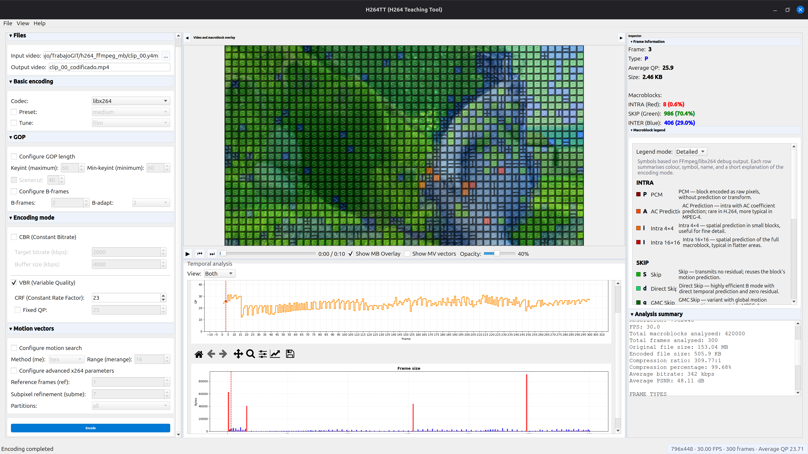
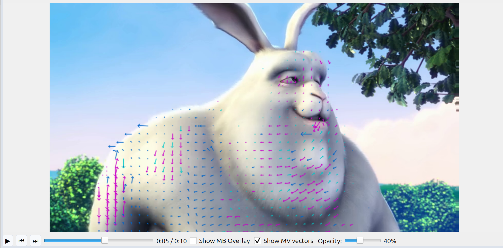

# H264TT (H264 Teaching Tool)

H264TT is a teaching-oriented H.264 analysis tool built around FFmpeg. It allows you to encode video, extract low-level analysis data, and inspect the results through an interactive GUI. The tool provides visual insights into macroblock partitions, motion vectors, and frame-level statistics.


*Full GUI showing macroblock overlay, encoding panel, and analysis inspector*

## Graphical User Interface Features

The H264TT GUI is designed for educational exploration of the H.264 codec.

- **Encoding Configuration**: The left panel provides full control over the encoding process. You can select the codec, preset, and tune settings. It supports various encoding modes including CBR, VBR, CRF, and fixed QP. You can also adjust GOP settings, B-frames, and motion vector search parameters.
- **Interactive Video Player**: The central area features a video player with real-time overlays.
    - **Macroblock Overlay**: Visualizes different macroblock types using color coding: INTRA (red), SKIP (green), and INTER (blue).
    - **Motion Vector Overlay**: Displays directional arrows for motion compensation. Forward L0 vectors appear in blue, backward L1 in magenta, and bi-predictive in cyan.
    - **Visual Controls**: Toggles for overlays and an opacity slider allow for detailed inspection of the underlying video frames.
- **Temporal Analysis**: Charts at the bottom track QP evolution over frames and frame size in bytes, providing a clear view of bitrate distribution and quality consistency.
- **Analysis Inspector**: The right panel offers a deep dive into frame-specific data.
    - **Frame Info**: Displays frame number, type, average QP, and size.
    - **Macroblock Legend**: A collapsible legend with detailed descriptions for each symbol.
    - **Analysis Summary**: Overall metrics including resolution, FPS, compression ratio, and PSNR.


*Motion vector overlay visualization*

## FFmpeg compatibility

This project is designed around FFmpeg 6.1.

Later versions may work, but low-level debug output and internals are not guaranteed to behave identically. Use FFmpeg 6.1 for consistent macroblock analysis results.

For convenience, prebuilt static binaries for Windows and Linux are included in the GitHub releases. These binaries are distributed under the *GNU General Public License (GPL)* because they were built with GPL-enabled components (including libx264). See [FFmpeg / FFprobe](#ffmpeg--ffprobe) for more details on licensing and usage.

## Installation

Clone the repository:

```bash
git clone https://github.com/valentinbarral/H264TT.git
cd H264TT
```

### Using uv (recommended)

Install dependencies:

```bash
uv sync
```

### Using pip

Create and activate a virtual environment:

```bash
python3 -m venv .venv
source .venv/bin/activate
```

Install dependencies:

```bash
pip install -r requirements.txt
```

## Running the tool

### GUI Launch

Using uv:
```bash
uv run H264TT
```

Using python:
```bash
python3 H264TT.py
```

### CLI Launch

Using uv:
```bash
uv run H264TT-cli input_video.mp4 --params "-c:v libx264 -preset medium -crf 23"
```

Using python:
```bash
python3 H264TT_cli.py input_video.mp4 --params "-c:v libx264 -preset medium -crf 23"
```

## Troubleshooting

### FFmpeg encoding fails
Verify your FFmpeg build includes libx264:
```bash
ffmpeg -encoders | grep x264
```
The teaching workflows require libx264 to function correctly.

### Qt or OpenCV issues
The project uses `opencv-python-headless` to avoid common GUI conflicts while providing necessary `cv2` functionality.

### Headless environments
If running on a remote server, ensure your Qt display environment is correctly configured before launching the GUI.

## Project structure

The main package consists of:
- `h264tt/`: Core logic, GUI components, and native helpers.
- `H264TT.py`: Primary GUI launcher.
- `H264TT_cli.py`: Command-line interface launcher.
- `H264TT_diagnose.py`: Diagnostic utility.

## License

This project is licensed under the **Creative Commons Attribution 4.0 International License (CC BY 4.0)**.

**Author:** Valentin Barral

## FFmpeg / FFprobe

This project invokes FFmpeg and FFprobe as external command-line tools.

For convenience, prebuilt static binaries for Windows and Linux are included in the GitHub releases. These binaries are distributed under the **GNU General Public License (GPL)** because they were built with GPL-enabled components (including libx264).

The main application does not link against FFmpeg libraries and does not include FFmpeg source code. FFmpeg and FFprobe are separate third-party executables invoked via subprocess.

For more information about FFmpeg licensing, see https://ffmpeg.org/legal.html.

## Screenshot attribution

The screenshots in this documentation contain footage from **Big Buck Bunny**.
- **License**: Creative Commons Attribution 3.0 (CC BY 3.0)
- **Attribution**: © copyright 2008, Blender Foundation / www.bigbuckbunny.org
- **Link**: https://peach.blender.org
